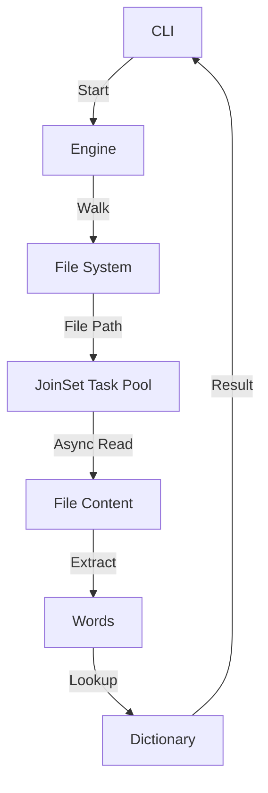

# Architecture Overview

`spell_check` is designed for high performance and strict safety.

## Core Components

### Engine
The `Engine` is responsible for orchestrating the scanning process.
- **Walker**: Uses the `ignore` crate to efficiently traverse the file system while respecting `.gitignore` and `.spellcheckignore` files.
- **Concurrency**: Leverages `tokio::task::JoinSet` to parallelize file scanning. It maintains a pool of up to 20 concurrent tasks to balance speed and system resources.
- **Word Extraction**: Uses a custom iterator to identify potential words, handling apostrophes (e.g., "don't") while ignoring alphanumeric strings that aren't words.

### Dictionary
The `Dictionary` provides O(1) lookups using a `HashSet`.
- **Pre-loading**: The embedded dictionary is loaded into memory at startup.
- **Case Insensitivity**: All words are normalized to lowercase during loading and lookup.

### Configuration
Uses `serde` and `toml` for robust schema validation and easy extensibility.

## Memory Safety
- **Zero Unsafe**: The codebase contains no `unsafe` blocks.
- **Safe Concurrency**: Uses `Arc` for thread-safe sharing of dictionaries and configurations across tasks.
- **Error Handling**: Uses `anyhow` for rich, context-aware error reporting instead of crashing.

## Concurrency Model

